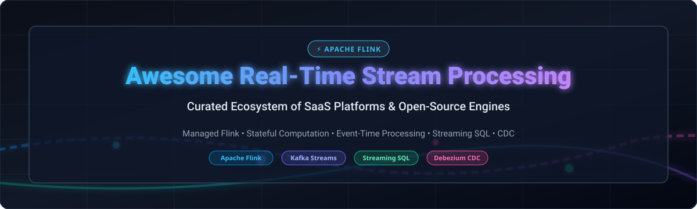
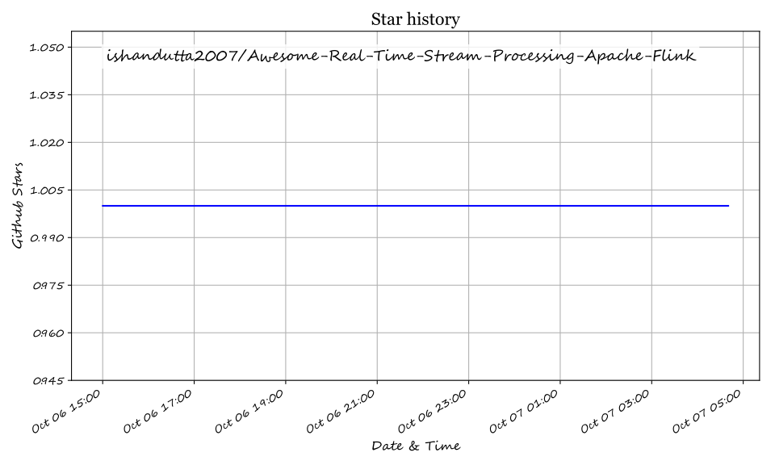

# Awesome Real-Time Stream Processing with Apache Flink ⚡

  

  
  
  
  
  
  
  
  

---

## 🚀 Overview & Ecosystem Guide

Welcome to the **Awesome Real-Time Stream Processing (Apache Flink) Ecosystem** repository! 🌊

This is a comprehensive, community-curated directory tracking **commercial SaaS platforms**, **managed cloud services**, and **open-source streaming data engines** built for processing high-volume continuous data streams with **exactly-once semantics**, **event-time processing**, **stateful computation**, and **low millisecond latency**.

Whether you are evaluating **Managed Apache Flink** on AWS or Confluent, implementing **Streaming SQL** via RisingWave or Arroyo, capturing database events with **Debezium CDC**, or running **Flink on Kubernetes**, this list helps streaming architects and data engineers select the optimal technology. 💡

---

## 📌 Table of Contents

- [☁️ SaaS & Managed Cloud Platforms](#️-saas--managed-cloud-platforms)
- [⚡ Open-Source GitHub Projects](#-open-source-github-projects)
- [🛠️ How to Contribute](#️-how-to-contribute)
- [💖 Support & Sponsorship](#-support--sponsorship)
- [⚠️ Disclaimer & Architectural Trade-Offs](#️-disclaimer--architectural-trade-offs)
- [📈 Star History](#-star-history)

---

## ☁️ SaaS & Managed Cloud Platforms

### 📊 Market Overview & Sector Analysis

> [!NOTE]
> The **Real-Time Stream Processing & Streaming Data Engine Market** is estimated at **$3.5B – $5.0B in 2026** (projected to reach **$12B+ by 2030** with a CAGR of ~22%). The sector is **moderately fragmented** with major cloud giants dominating managed infrastructure, while specialized streaming platforms and open-source ecosystems hold significant market share for advanced stateful processing and real-time OLAP. 📈

| Platform | Pricing 🏷️ | Free Tier / Trial Limit 🎁 | Company Scale (Revenue / Valuation) 🏛️ | Best For 🎯 |
| :--- | :--- | :--- | :--- | :--- |
| **[Google Cloud Dataflow](https://cloud.google.com/dataflow)** | ~$0.069/vCPU-hr & ~$0.009/GB-hr (streaming) | No free tier ($300 GCP new account credit) | **$2.5T+ (Alphabet)** | GCP-native streaming pipelines |
| **[Amazon Managed Service for Apache Flink](https://aws.amazon.com/managed-service-apache-flink/)** | $0.11 / KPU-hour (~1 vCPU, 4GB RAM) | No free tier (pay-as-you-go) | **$2.1T+ (Amazon)** | AWS-native Flink workloads |
| **[Databricks Structured Streaming](https://www.databricks.com/)** | ~$0.20 – $0.30 per DBU-hour (Core tier) | 14-day free trial ($400 free credits) | **$43B Valuation** ($2.4B+ ARR) | Lakehouse streaming & Delta Live Tables |
| **[Confluent Cloud Flink](https://www.confluent.io/product/flink/)** | ~$0.21 / CFU-hour (Confluent Flink Unit) | $400 free credits (valid 30 days) | **$11B (Acquired by IBM)** ($1.2B ARR) | Confluent Kafka ecosystem users |
| **[Aiven for Apache Flink](https://aiven.io/flink)** | Hourly compute rates by region/size | 30-day free trial (trial credits) | **$3B Valuation** ($100M+ ARR) | Multi-cloud managed Flink |
| **[StarTree Cloud](https://startree.ai/)** | $999/mo (Standard) or $0.11/hr per vCPU (BYOC) | Forever Free Tier (10 vCPUs, 100GB storage) | **$500M+ Est. Valuation** ($30M+ ARR) | Real-time user-facing analytics |
| **[Ververica Cloud](https://www.ververica.com/)** | Usage-based per compute unit | 30-day free trial ($400 free credits) | **$103M Acquisition** (by Alibaba) | Enterprise Flink by original creators |
| **[Decodable](https://www.decodable.co/)** | Credit-based per task-hour | Forever Free Tier (no credit card required) | **$50M – $100M Est. Valuation** ($25.5M funding) | Simple SQL streaming ETL |
| **[DeltaStream](https://deltastream.io/)** | Serverless compute consumption pricing | Free trial available via console | **$20M – $50M Est. Valuation** ($10M+ funding) | SQL-based Kafka stream processing |
| **[Upsolver](https://www.upsolver.com/)** | ~$0.10 per GB of data ingested | 14-day free trial available | **$20M – $50M Est. Valuation** ($20M+ funding) | Streaming data ingestion into data lakes |

---

## ⚡ Open-Source GitHub Projects

### 🌟 Top Repositories (Sorted by Stars_Count)

- **[Apache Spark](https://github.com/apache/spark)**  ⚡  
  **Unified batch and stream processing engine**, Apache-2.0 licensed. Features Spark Structured Streaming for micro-batch and continuous processing with exactly-once guarantees. **Best for teams needing unified batch, streaming, and ML pipelines**.

- **[Apache Kafka](https://github.com/apache/kafka)**  🐙  
  **Distributed event streaming platform and stream processing library (Kafka Streams)**, Apache-2.0 licensed. Provides lightweight client library stream processing with stateful operations and exactly-once semantics without running a dedicated cluster. **Best for Kafka-native stream processing applications**.

- **[Apache Flink](https://github.com/apache/flink)**  🐿️  
  **The de facto standard for stateful stream processing**, Apache-2.0 licensed. True event-at-a-time streaming with low millisecond latency, advanced event-time processing, savepoints, and stateful calculations at massive scale. **Best for mission-critical, stateful stream processing at scale**.

- **[Vector](https://github.com/vectordotdev/vector)**  🦀  
  **High-performance observability data pipeline in Rust**, MPL-2.0 licensed. Lightweight log, metric, and event router designed to collect, transform, and stream data efficiently. **Best for high-throughput observability data routing**.

- **[Logstash](https://github.com/elastic/logstash)**  🪵  
  **Server-side data processing pipeline**, Elastic License / Apache-2.0. Ingests data from a multitude of sources simultaneously, transforms it, and streams it to your favorite storage or analytics stash. **Best for log aggregation and Elastic ecosystem data pipelines**.

- **[Fluentd](https://github.com/fluent/fluentd)**  📄  
  **Unified logging layer and data collector**, Apache-2.0 licensed. Decouples data sources from backend systems by providing a unified JSON logging layer. **Best for unified log collection across microservices**.

- **[Debezium](https://github.com/debezium/debezium)**  🗄️  
  **The leading open-source Change Data Capture (CDC) platform**, Apache-2.0 licensed. Captures low-latency row-level changes from PostgreSQL, MySQL, MongoDB, Oracle, and SQL Server for stream processing. **Best for database change data capture and real-time database sync**.

- **[Apache SeaTunnel](https://github.com/apache/seatunnel)**  🌊  
  **Very high-performance, distributed, massive data integration tool**, Apache-2.0 licensed. Supports real-time synchronization and streaming data pipeline execution across diverse data sources. **Best for high-throughput data integration and sync**.

- **[RisingWave](https://github.com/risingwavelabs/risingwave)**  🌊  
  **Distributed SQL streaming database**, Apache-2.0 licensed. PostgreSQL-compatible interface designed for real-time stream processing and incremental view updates with incremental materialized views. **Best for streaming SQL with database-like developer experience**.

- **[Redpanda Connect (formerly Benthos)](https://github.com/redpanda-data/connect)**  🐼  
  **Stream processing buffer and transformation engine without code**, Apache-2.0 licensed. Uses simple, declarative YAML pipelines to connect sources, execute transformations, and sink to stream destinations. **Best for lightweight, code-free streaming ETL**.

- **[Apache Beam](https://github.com/apache/beam)**  💡  
  **Unified programming model for batch and stream processing pipelines**, Apache-2.0 licensed. Executes portably across execution backends including Apache Flink, Apache Spark, and Google Cloud Dataflow. **Best for portable pipelines across compute engines**.

- **[Fluent Bit](https://github.com/fluent/fluent-bit)**  🐝  
  **Super-lightweight telemetry agent and stream processor in C**, Apache-2.0 licensed. Collects logs, metrics, and traces with extremely low memory footprint. **Best for containerized and edge event log streaming**.

- **[Apache Storm](https://github.com/apache/storm)**  🌩️  
  **Distributed real-time computation system**, Apache-2.0 licensed. Pioneer of real-time stream processing with spouts and bolts for unbound stream processing. **Best for legacy real-time event processing workloads**.

- **[Flink CDC](https://github.com/apache/flink-cdc)**  🔄  
  **Change Data Capture connectors for Apache Flink**, Apache-2.0 licensed. Enables database CDC directly via Flink SQL queries with schema evolution support. **Best for database stream ingestion into Flink tables**.

- **[Materialize](https://github.com/MaterializeInc/materialize)**  🔮  
  **Streaming database built on Timely Dataflow**, BSL licensed. Provides PostgreSQL-compatible streaming SQL with continuous, incremental view maintenance and strong consistency guarantees. **Best for complex SQL join queries on real-time data streams**.

- **[Apache NiFi](https://github.com/apache/nifi)**  🎛️  
  **Automated data flow and data routing platform**, Apache-2.0 licensed. Provides visual drag-and-drop interface for managing real-time data streams, routing, and system integration. **Best for visual data flow automation and edge-to-cloud ingest**.

- **[Arroyo](https://github.com/ArroyoSystems/arroyo)**  🚀  
  **Distributed stream processing engine written in Rust**, Apache-2.0 licensed. Designed for low latency SQL streaming pipelines without requiring a JVM runtime. **Best for high-performance, Rust-native streaming SQL**.

- **[Flink Kubernetes Operator](https://github.com/apache/flink-kubernetes-operator)**  ☸️  
  **Native Kubernetes operator for Apache Flink**, Apache-2.0 licensed. Automates life-cycle management, savepoints, HA, and auto-scaling for Flink jobs on Kubernetes clusters. **Best for running Flink applications natively on Kubernetes**.

- **[Apache Samza](https://github.com/apache/samza)**  📦  
  **Stateful stream processing framework**, Apache-2.0 licensed. Built closely with Apache Kafka and YARN for stateful stream processing with local state management. **Best for large-scale stateful Kafka processing pipelines**.

- **[Flink ML](https://github.com/apache/flink-ml)**  🤖  
  **Machine learning library for Apache Flink**, Apache-2.0 licensed. Provides machine learning algorithms and pipeline APIs for real-time online ML training and inference. **Best for real-time machine learning on continuous streams**.

- **[ksqlDB](https://github.com/confluentinc/ksql)**  🔍  
  **Event streaming database purpose-built for Kafka**, Confluent Community License. Allows building stream processing applications using familiar SQL syntax on Kafka topics. **Best for SQL-based stream processing on Kafka streams**.

---

## 🛠️ How to Contribute

Contributions are always welcome! Help keep this streaming ecosystem directory up to date: 🤝

1. 🍴 **Fork** the repository.
2. 📝 **Add/edit** entries in `README.md` maintaining the exact Markdown format.
3. ℹ️ **Include**: Project Name, Official Link, Stars_Badge, 1–2 sentence description, License, and Key Use Case.
4. 🚀 **Submit a Pull Request** with a brief summary of the added platform or engine.

---

## 💖 Support & Sponsorship

If you find this repository helpful for your streaming architecture research or production evaluations, please consider supporting the project:

- ⭐️ **Star** this repository on GitHub to increase its visibility.
- 🔀 **Fork** it to keep a personal bookmark of stream processing resources.
- 📢 **Share** it with fellow data engineers, streaming architects, and colleagues.
- ☕ **Buy me a coffee**: Support ongoing open-source curation and maintenance via the [GitHub Sponsor Dashboard](https://github.com/sponsors/ishandutta2007).

  

Thank you for being part of the real-time data streaming community! ❤️

---

## ⚠️ Disclaimer & Architectural Trade-Offs

- **Community-Curated**: This list is community-curated for informational purposes and does not constitute an explicit commercial endorsement.
- **State Management**: Stateful computation (e.g., Flink savepoints, Kafka Streams state stores, Materialize arrangements) requires operational planning for state backups, schema migration, and checkpoint recovery. 💾
- **Latency vs. Throughput**: Event-at-a-time engines (Apache Flink) deliver sub-second latency; micro-batch processing (Spark Structured Streaming) optimizes for high batch throughput. Choose based on latency requirements. ⏱️

---

## 📈 Star History

---

  <b>Made with ❤️ for data engineers, streaming architects, and real-time data enthusiasts.</b> 
  <a href="https://github.com/ishandutta2007/Awesome-Awesome-Awesome">Awesome Awesome Awesome List</a>

## Star History

<a href="https://star-history.com/#ishandutta2007/Awesome-Real-Time-Stream-Processing-Apache-Flink&Timeline" align="center">
  <picture>
    <source media="(prefers-color-scheme: dark)" srcset="assets/ishandutta2007_Awesome-Real-Time-Stream-Processing-Apache-Flink_growth.svg">
    
  </picture>
</a>
